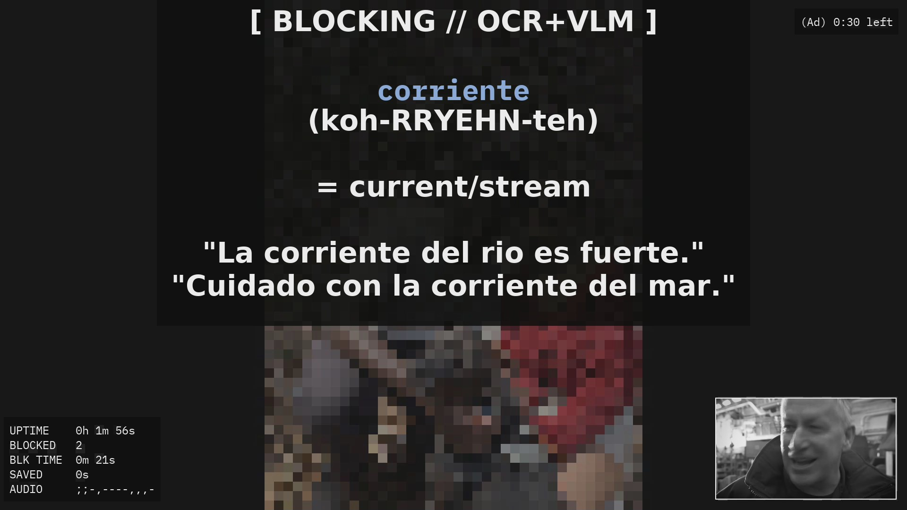
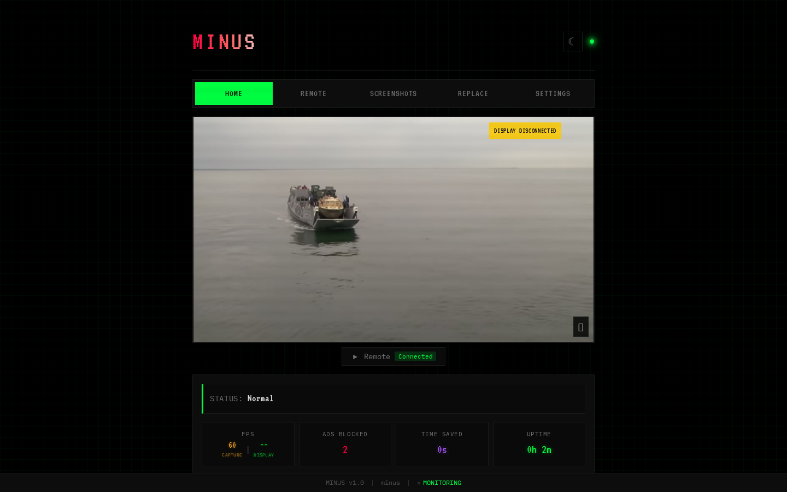
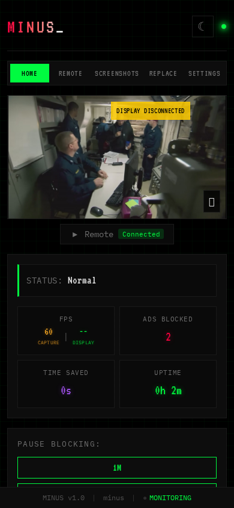

# Minus

**An open-source HDMI "streaming stick" that sits between your streaming device and your TV, detects ads in real time with on-device ML, and replaces them with something better — like Spanish vocabulary practice.**

No cloud. No subscriptions. No data leaves your living room. Everything — OCR, a fine-tuned vision-language model, and speech recognition — runs on the device itself.



*An ad break, as seen through Minus: the ad is muted and hidden behind a vocabulary card, with a live (greyscale) preview in the corner so you know when it's safe to come back.*

## How it works

Minus is a 4K@60fps HDMI passthrough. Your Roku / Fire TV / Google TV plugs into Minus, and Minus plugs into your TV. Three ML signals watch the stream and vote on whether an ad is playing:

```
┌──────────────┐     ┌────────────────────┐     ┌─────────────────────┐
│   HDMI IN    │────▶│     ustreamer      │────▶│  HDMI OUT to TV     │
│ (Roku, etc.) │     │ (MPP hw encoding)  │     │  (DRM/KMS, 60fps)   │
└──────────────┘     └────────┬───────────┘     └─────────────────────┘
                              │ snapshots + audio
              ┌───────────────┼────────────────┐
              ▼               ▼                ▼
     ┌────────────────┐ ┌──────────────┐ ┌──────────────┐
     │  PaddleOCR     │ │  minus-v0.1  │ │  Moonshine   │
     │  RK3588 NPU    │ │  (VLM)       │ │  ASR (CPU)   │
     │  reads ad UI   │ │  Axera NPU   │ │  hears ad    │
     │  text ~400ms   │ │  ~370ms      │ │  language    │
     └────────────────┘ └──────────────┘ └──────────────┘
              └───────────────┼────────────────┘
                              ▼
                    blocking decision engine
              (mute + overlay, typically < 2s to react)
```

- **OCR** (PaddleOCR on the RK3588's NPU) reads on-screen ad UI: "Skip in 5", "Ad 2 of 3", countdown timers — including the character misreads OCR makes on real TVs.
- **[minus-v0.1](https://huggingface.co/TheGarageDev/Minus-v0.1)** — our fine-tuned 450M-parameter vision-language model (based on LFM2.5-VL) running on an Axera AX8850 NPU — looks at the frame and decides *"is this an advertisement?"* in ~370ms, no text required.
- **ASR** (Moonshine tiny-en on CPU) listens for marketing language as a confirmation signal.

When the votes say "ad": audio mutes instantly, the screen switches to a 60fps overlay (rendered in the hardware JPEG encoder — no desktop stack, no X11), and you get a Spanish word to learn instead. When the ad ends — typically within a second — the show comes back.

## The model

The heart of Minus is **minus-v0.1**, published on Hugging Face: **[TheGarageDev/Minus-v0.1](https://huggingface.co/TheGarageDev/Minus-v0.1)**.

It's a fine-tune of [LiquidAI's LFM2.5-VL-450M](https://huggingface.co/LiquidAI) trained on frames captured from real TV streams, compiled into fused-layer models for the Axera NPU. Inference is *prefill-only* — the answer is read directly from the logits, no token generation — which makes latency deterministic.

| Metric | Value |
|---|---|
| Accuracy (800-image holdout) | **97.0%** |
| Ad recall | 94.8% |
| Non-ad recall (false-positive resistance) | **99.2%** |
| Inference latency | ~0.37s per frame, deterministic |
| Parameters | 450M |

The same model also classifies screen state (playing / paused / menu / dialog / screensaver) for autonomous mode.

## Features

- **Real-time ad blocking** — OCR + VLM + ASR triangulation, with a battle-tested decision engine (anti-flicker, static-screen suppression, transition-frame holds, frozen-stream detection)
- **Ad replacement, not just blocking** — Spanish vocabulary cards (750+ entries), trivia, haikus, or a photo screensaver of your own pictures
- **4K@60fps passthrough** — zero-copy VPU/RGA pipeline in a [patched ustreamer](https://github.com/garagehq/ustreamer), ~5% CPU
- **Instant audio mute** during ads, with automatic recovery watchdogs
- **Web UI** — live feed, pause controls, detection history, screenshot review, settings — from any device on your network
- **Streaming device remotes** — Fire TV (ADB), Roku (ECP), Google TV (ADB) integration, including automatic "Skip Ad" pressing
- **Autonomous mode** — keeps YouTube playing unattended on a schedule to collect training data, guided by the VLM
- **Extras** — IR blaster for HDMI switches, WS2812B status LED strip, WiFi captive portal for setup, HDCP 1.4 capture support

## Web UI

| Desktop | Mobile |
|---|---|
|  |  |

The dark-terminal web UI runs on the device (Flask) and gives you the live feed, block/pause controls, per-detection history, a Tinder-style screenshot review flow for improving the training data, device remote controls, and every setting — no app required.

## Hardware

| Component | Notes |
|---|---|
| [Radxa Rock 5B+](https://radxa.com/products/rock5/5bp/) | RK3588 SoC — HDMI input port, NPU for OCR, VPU for 4K60 JPEG encoding |
| Axera AX8850 accelerator (M.2) | Runs minus-v0.1; ~370ms per inference |
| HDMI cables | Source → Minus → TV |
| *Optional:* IR LED on GPIO | Controls an HDMI switch for multi-device setups |
| *Optional:* WS2812B 8-LED strip | Status indicator (idle / blocking / error / …) |
| *Optional:* HDCP 1.4 sink key | For capturing HDCP-protected sources — see [hdcp/](hdcp/README.md) |

No display server, no desktop environment — Minus talks straight to DRM/KMS and the hardware encoders.

## Getting started

```bash
git clone https://github.com/garagehq/Minus-streaming-stick.git /home/radxa/Minus
cd /home/radxa/Minus

# Install system + Python dependencies (GStreamer, fonts, rknnlite, axengine, ...)
# then build the patched ustreamer:
git clone https://github.com/garagehq/ustreamer.git /home/radxa/ustreamer-garagehq
cd /home/radxa/ustreamer-garagehq && make WITH_MPP=1
cp ustreamer /home/radxa/ustreamer-patched

# Download the model
# → https://huggingface.co/TheGarageDev/Minus-v0.1
#   into /home/radxa/axera_models/minus-v0.1/

# Run directly:
cd /home/radxa/Minus && sudo python3 minus.py

# ...or install as a service that starts on boot:
sudo ./install.sh
```

The full dependency list and deployment walkthrough live in [docs/DEPLOYMENT.md](docs/DEPLOYMENT.md). Model paths and thresholds are configurable via environment variables (`MINUS_VLM_MODEL_DIR`, `MINUS_OCR_MODEL_DIR`, and many more — see [CLAUDE.md](CLAUDE.md) for the exhaustive tuning reference).

Minus auto-detects the connected HDMI output, resolution, DRM plane, and audio device at startup, and works with both 4K and 1080p displays.

## Documentation

| Document | Description |
|---|---|
| [docs/FEATURES.md](docs/FEATURES.md) | Complete feature list |
| [docs/ARCHITECTURE.md](docs/ARCHITECTURE.md) | System architecture and data flow |
| [docs/DEPLOYMENT.md](docs/DEPLOYMENT.md) | Setting up a new device from scratch |
| [docs/API.md](docs/API.md) | Web UI REST API |
| [docs/ASR.md](docs/ASR.md) | Audio-based ad confirmation |
| [docs/AUDIO.md](docs/AUDIO.md) | Audio passthrough pipeline |
| [docs/AESTHETICS.md](docs/AESTHETICS.md) | Visual design guide |
| [docs/IR_TRANSMITTER.md](docs/IR_TRANSMITTER.md) | IR blaster for HDMI switches |
| [docs/STATUS_LEDS.md](docs/STATUS_LEDS.md) | WS2812B status strip |
| [hdcp/README.md](hdcp/README.md) | HDCP 1.4 setup for the HDMI input |
| [CLAUDE.md](CLAUDE.md) | Deep-dive engineering notes — detection tuning, every hard-won bug fix |

## Related projects

- **[Minus-chrome-extension](https://github.com/garagehq/Minus-chrome-extension)** — the same idea for your browser: on-device ML ad blocking as a Chrome extension.
- **[garagehq/ustreamer](https://github.com/garagehq/ustreamer)** — our ustreamer fork with RK3588 MPP hardware encoding, NV12/NV24/BGR24 capture, and the 60fps blocking-overlay compositor.
- **[TheGarageDev/Minus-v0.1](https://huggingface.co/TheGarageDev/Minus-v0.1)** — the model, on Hugging Face.

## Support

Minus is free, open-source, and runs entirely on your own hardware — no ads (obviously), no tracking, no server bills passed on to you. If it has saved you from a few unskippable ad breaks, you can buy me a coffee ☕:

<a href="https://buymeacoffee.com/cyrilengmann" target="_blank"></a>

> **[buymeacoffee.com/cyrilengmann](https://buymeacoffee.com/cyrilengmann)**

## License

- **Code:** [GPL-3.0](LICENSE)
- **Documentation:** [CC BY-SA 4.0](LICENSE-DOCS)
- **Hardware designs:** [CERN-OHL-S-2.0](LICENSE-HARDWARE)
